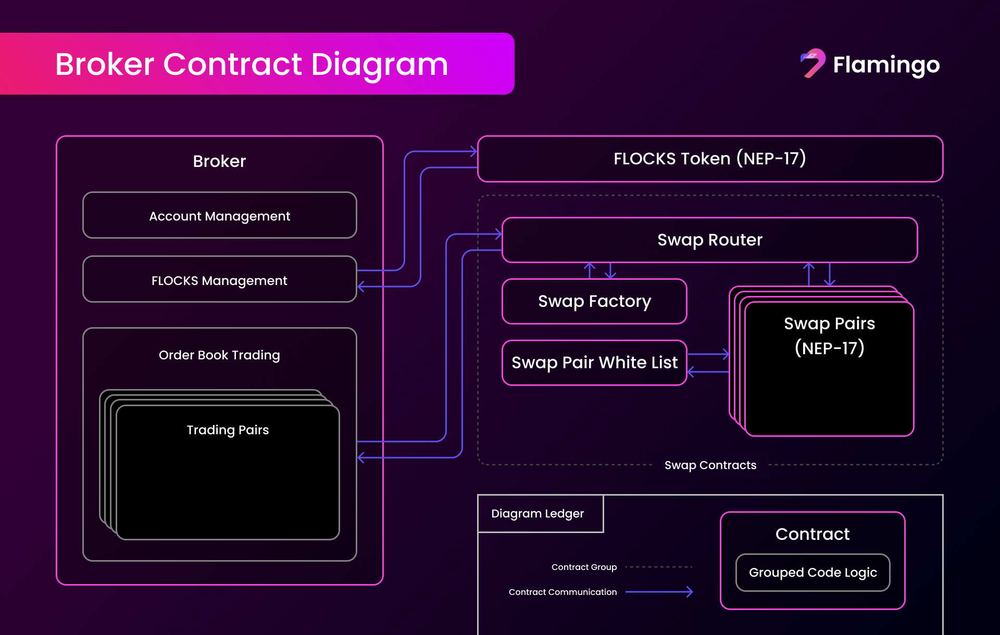

# Broker Contract Specification

## Abstract

This document describes the broker contract specification. The broker contract is a smart contract that incorporates
tree main group of functionalities: Order Book Trading, FLOCKS Management and Account Management.

## Table of Contents

1. [Introduction](#1-introduction)
2. [Order Book Trading](#2-order-book-trading)
	1. [Functional Requirements](#21-functional-requirements)
3. [FLOCKS Management](#3-flocks-management)
	1. [Functional Requirements](#31-functional-requirements)
4. [Account Management](#4-account-management)
	1. [Functional Requirements](#41-functional-requirements)

## 1. Introduction

The broker contract is a smart contract that incorporates three main group of functionalities:

1. **Order Book Trading**: The broker contract allows users to place orders to buy or sell assets. The broker contract
	 matches the orders and executes the trades. The logic is based on the Order Book V2 contract which spesification can
	 be found [here](../OrderBookV2/Order_Book_V2_Specification.md).

2. **FLOCKS Management**: The broker contract manages the operations related to FLOCKS such as epochs, dividends,
	 compounding, etc. The logic is based on the FLOCKS contract which code can be
	 found [here](https://github.com/flamingo-finance/FLAM/tree/master/src/Flocks). The main reason for integrating
	 FLOCKS into the broker contract is to allow trading fees to be collected within the broker contract thus not
	 requiring users to pay extra fees for transferring assets to the FLOCKS contract.

3. **Account Management**: The broker contract manages the user's account information such as balances, positions, etc.
	 The main reason for integrating account management into the broker contract is to allow users to trade without
	 requiring them to transfer their assets to the broker contract for each trade.

The following image shows a diagram of the broker contract and how it interacts with the other contracts in the Flamingo
Finance ecosystem.

In the following sections, we will describe the broker contract in more detail. We will describe each of the three
functionalities in separate sections.

## 2. Order Book Trading

The most detail specification of the Order Book Trading can be
found [here](../OrderBookV2/Order_Book_V2_Specification.md). This section will only describe how the broker contract
should manage multiple order books for different trading pairs.

#### 2.1. Functional Requirements

1. **Trading Pairs**
	- The contract MUST support the creation of multiple order books for different trading pairs.
	- The contract MUST allow settings such as tree-bit-length, price precision, quote token and base token for each
		trading pair upon creation.
	- The contract MUST allow the owner to pause trading for a specific trading pair.
	- The contract MUST allow the owner to remove a trading pair.
	- If a trading pair is removed, the contract MUST cancel all orders and return the assets to the users.
	- The contract MUST allow ONLY the owner to create, remove or pause trading pairs.

2. **Convert Trading**
	- The contract MUST allow users to trade between different trading pairs in a single transaction by a specified
		path set by the user.
	- The contract MUST allow the user to input the input asset, output asset, input amount, the path.
	- The contract SHOULD NOT be required to specify a minimum output amount. This type of trade is to be considered a
		market order.
	- The contract MUST give an error if the path is not valid. By valid we mean that the path is a list of trading pairs
		that can be used to convert from the input asset to the output asset.

3. **Fees**
	- The contract MUST allow the owner to set the trading fee for each trading pair.
	- The contract SHOULD have a default trading fee that will be used if no trading fee is set for a trading pair.
	- The contract MUST allow maker and taker fees to be set separately.
	- The contract SHOULD leave trading fees in the contract in such a way that they can be used to pay dividends to
		the FLOCKS holders.

## 3. FLOCKS Management

The most detail specification of the FLOCKS contract should operate can be found in the docs here:
[https://coda.io/d/_ddyOwRpwEFO/FLOCKS-In-review-Work-in-progress_suZ9m](https://coda.io/d/_ddyOwRpwEFO/FLOCKS-In-review-Work-in-progress_suZ9m)

The code that is written so far can be found here:
[https://github.com/flamingo-finance/FLAM/tree/master/src/Flocks](https://github.com/flamingo-finance/FLAM/tree/master/src/Flocks)

The code that is written so far should be absorbed into the broker contract. The only exception is that a FLOCKS NEP-17
token should be created and the broker contract should be able to interact with this token (see the diagram above).
This should be done in a way so that the token is separated by the operations of the broker contract. The FLOCKS token
is then easily transferable, tradeable, and usable in many other ways.

#### 3.1. Functional Requirements

See the FLOCKS contract specification for the functional requirements.

## 4. Account Management

The account management is primarily used to store the user's balances and positions. We use a deposit/withdraw pattern
to allow users to deposit assets into the broker contract and withdraw them back to their wallets. This pattern is
used to allow users to trade without requiring them to transfer their assets to the broker contract for each trade.

#### 4.1. Functional Requirements

1. **Owner/Admin**
	- The contract MUST allow the owner to manage the trading asset whitelist.

2. **Deposit/Withdraw**
	- The contract MUST allow users to deposit assets into the broker contract.
	- The contract MUST allow users to withdraw assets from the broker contract.
  - The contract MUST only allow users to deposit and withdraw assets that are supported by the broker contract. This
    means that the asset should be listed in the broker contracts trading asset whitelist.
