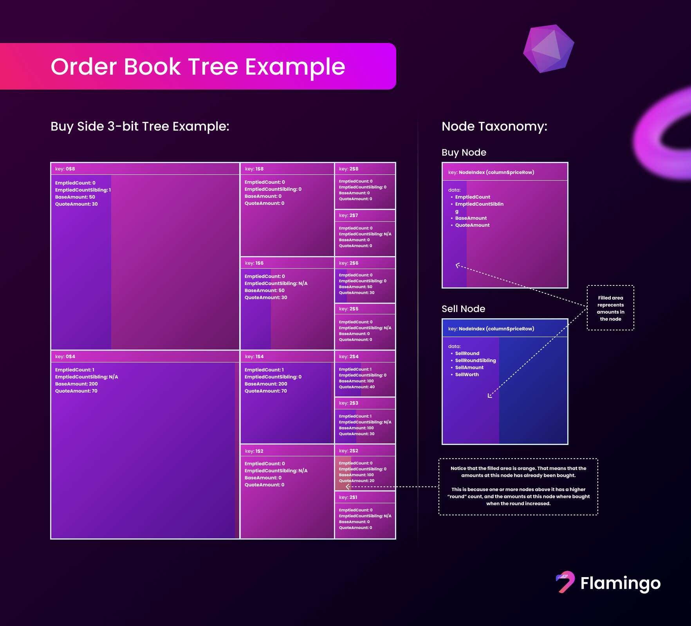

# Order Book V2 Specification

## Abstract

This document describes the order book v2 specification. The order book v2 is a new version of the order book that is
currently used on [Flamingo Finance](https://flamingo.finance/trade/advanced).

## Table of Contents

- [Order Book V2 Specification](#order-book-v2-specification)
	- [Abstract](#abstract)
	- [Table of Contents](#table-of-contents)
	- [1. Introduction](#1-introduction)
	- [2. Order Book Structure](#2-order-book-structure)
	- [3. Optimization Techniques](#3-optimization-techniques)
		- [3.1. Rounds](#31-rounds)
		- [3.2. Dynamic Price Precision](#32-dynamic-price-precision)
	- [5. Product Requirements](#4-product-requirements)
		- [5.1. Functional Requirements](#41-functional-requirements)
		- [5.2. Performance Requirements](#42-performance-requirements)
		- [5.3. Security Requirements](#43-security-requirements)
		- [5.4. Operational Requirements](#44-operational-requirements)
	- [6. User Stories & Example Use Cases](#5-user-stories--example-use-cases)
	- [7. Conclusion](#5-conclusion)

## 1. Introduction

The order book v2 is designed with two goals in mind:

1. To guarantee execution of limit orders when price conditions in the AMM match the limit orders.
2. To guarantee constant execution complexity for limit orders so that:
	1. the GAS cost of trading is predictable
	2. and transactions do not fail on-chain if multiple limit orders are executed at the same time.

The order book v2 is designed to be used in conjunction with the AMM. The takers are forced to buy and sell both in the
AMM and in the order book. Forcing the trading to happen in both places ensures that arbitragers always have to trigger
limit orders when trading, leading to a better user experience for limit orders as they are guaranteed to be executed
when the price conditions are met.

The order book v2 also aims to provide a better user experience for limit orders by guaranteeing that the execution
complexity of limit orders is constant. This is achieved by using a tree-like structure for noting limit orders. More on
this in the following section.

## 2. Order Book Structure

The order book v2 uses a tree-like structure to store limit orders. The tree is a binary tree where each node contains
an upper bound price and 6 values for tracking the liquidity available at that price. The tree has an upper bound price
that is defined by how many columns (levels) the tree has. The tree has a fixed number of columns, and each column has a
fixed number of nodes. The number of columns we use is divisible by 8 because we use 1 byte for storing the price
indices. The number of bytes we use is called the tree byte length. The tree byte length is a storage variable that
defines how many bytes we use to store the price indices.

Take a look at the following code snippet to see how we calculate the number of columns, nodes per column:

```
tree_byte_lenght = 2
number_of_columns = price_byte_precision * 8
nodes_per_column = 2 ^ (column_bit_index + 1)
```

> Note: If we have an upper bound price of 256 (255 + 1), we say that we have an 1 byte tree. If we have an upper bound
> price of 65536 (65535 + 1), we say that we have a 2 byte tree. As you can see the tree byte length controls how much
> precision we have in the price. The more bytes we use, the more precision we have in the price. Precision meaning
> how many different prices users can place orders at.

We start with a column of two nodes. For every column we add we double the amount of nodes in the column compared to
the previous column. We have two separate trees for buy and sell orders. This is to compress the tree as much as
possible so that the gas cost of trading is as low as possible. The tree also have a concept of **rounds** that further
helps with compressing the tree. We will talk more about rounds work in
the [Optimization Techniques](#3-optimization-techniques) section.

The following image shows the structure of the tree. Note that the image uses a 3-bit (bit, not bytes) tree for
illustration purposes. The actual tree will have a higher number of columns and nodes per column.



In the image we can see the data that is stored in each node. Each node is addressable by a `NodeIndex`. Each node
contains the following data:

```csharp
public class PriceNode
{
	// The quantity of base token at the node.
	public BigInteger BaseAmount;
	// The quantity of quote token at the node.
	public BigInteger QuoteTotal;
	// Indicates how many times the node has been emptied.
	public BigInteger EmptiedCount;
	// Indicates how many times the sibling node has been emptied.
	public BigInteger EmptiedCountSibling;
}
```

Let's go trough what each field means:

- **NodeIndex**: The index of the column that the node is in. This is field is not actually stored in the node,
	but it is the key that is used to find the node in the tree, hence we do not need to store it (for efficiency).
	The index consists of two parts: the column index and the price row. The **column index** is the index of the column
	and the **price row** defines the upper bound price of the that node. The lower bound price of the node is defined
	by the upper bound price of the node below it. If there is no node below it, the lower bound price is 1 (the smallest
	decimal of the token, e.g. 1 wei for ETH). The upper and lower bound prices are used to determine the price range
	of the node, but we have a multiplier that is used to determine the actual price of the node. More on this in the
	section about [Dynamic Price Precision](#32-dynamic-price-precision).
- **BaseAmount**: The amount of the base token that is available to trade in the nodes price range.
- **QuoteTotal**: The amount of the quote token that is available to trade in the nodes price range.
- **EmptiedCount**: The round in which all the liquidity in the node was used up and the node was emptied. This is
	used to rack the liquidity that is available in all the descendants of the node.
- **EmptiedCountSibling**: The same as the [Sell/Buy]Round, but for the sibling of the node. This is used to optimize
	the tree so that we do not have to update sibling node in case we deplete the liquidity of the sibling node.

Take note that `NodeIndex` in the upper left corner of each use 1-based indexing for the price. We use 1-based
indexing because we do not want it to be possible to place orders at a price of zero. The technical implementation does
not have to use 1-based indexing, but it should instead account for the fact that the first column has a price index
of 1.

### 3. Optimization Techniques

#### 3.1. Rounds

The order book v2 uses the concept of rounds to compress the tree. The wish is that we only write to one node for each
column when we update the tree. If we deplete a node of liquidity and still need to buy or sell more, we move to the
node above it to buy or sell more, this would lead to two updates in the column. This is strictly not necessary as we
can just move to the sibling of the node, buy or sell more there, then note that the **Buy/SellRoundSibling** has
increased by one and is therefore empty.

When we parse through the tree again later we always check the **Buy/SellRoundSibling** of the sibling if we are on a
"bottom" node (a node with an odd price index) to see if it is empty. If it is empty, we can infer that all the
liquidity in the node has been used up and act accordingly; whether we are placing a new order or buying/selling.

#### 3.2 Dynamic Price Precision

The order book v2 uses a dynamic price precision to optimize the tree. In a simple approach price precision is defined
by the number of columns in the tree. This limits the range of prices that can be used in the order book. Because of
this limitation the order book will use a multiplier for the prices so that a larger price range can be achieved using
less storage. The multiplier can be adjusted for each trading pair so that the price range is always optimal for the
trading pair.

The dynamic price precision consist of two parts: price shelfs and price multipliers. Each shelf represents a range of
prices and an associated multiplier. The number of shelfs can be dynamic and is represented by an integer. For example,
if we have 8 shelfs, and 64 nodes in the last column of the tree, the first shelf would represent the price range of
1 to 8, the second shelf would represent the price range of 9 to 16, and so on.


### 5. Product Requirements

#### 5.1. Functional Requirements

1. **Order Placement**
	- The system MUST support the placement of limit orders.
	- Orders MUST specify the asset pair, quantity, and limit price.
	- The system MUST provide a mechanism to cancel orders, even if the order has been partially executed.
	- The system MUST support limit orders. Limit orders are filled until the specified price defined in the order is
	  reached. The limit order should utilize the order book and AMM liquidity pool to fill the order.
	- The system MUST also support limit orders using only the order book (no AMM liquidity pool involved).
	- The system MUST support placing market orders. Market orders are filled until there is no amount left in the order
	  and does not have a limit price (it will not stop at a specific price). The market order should utilize the order
	  book and AMM liquidity pool to fill the order.
	- The system MUST support partial fills of limit orders. If a limit order is partially filled, the remaining quantity
		SHOULD remain in the order book until it is fully executed or canceled.
  - The executed orders in a trade SHOULD be claimable and not updated one-by-one immediately as users trade in the
    order book. This is to save gas costs.

2. **Price Matching**
	- The system MUST match orders based on the price conditions specified.
	- Orders with the best price SHOULD be executed first.
	- Orders MUST NOT be executed at a price worse than specified in the limit order.
	- Market orders SHOULD be executed immediately at the best available price in the order book.
	- Market limit orders SHOULD be executed immediately at the best available price in the order book, and then the
		remaining quantity is executed as a limit order.
	- The system should execute market trades in the AMM and the order book at the same time to give users the best
		possible price.

3. **Asset Handling**
	- The system SHOULD support users depositing and withdrawing assets to their "account" in the contract if it saves
		gas costs.
	- The system SHOULD support multiple assets with different decimal places.
	- The system SHOULD support multiple trading pairs with different price precisions.

4. **Execution Guarantee**
	- Limit orders MUST be executed when price conditions in the AMM match the limit orders.
	- The system SHOULD ensure high availability and reliability for order execution.

5. **Execution Complexity**
	- The system MUST maintain a constant execution complexity for limit orders.
	- The GAS cost for trading SHOULD be predictable and consistent.
	- The system MUST NOT fail transactions due to high volume or multiple simultaneous limit orders except when the
		user has specified that the transaction should fail if specific criteria are not met, in which case the
		transaction MUST fail if the criteria are not met.

6. **Fees**
	- The system MUST support fee collection for trades.
	- The system SHOULD collect fees for trades in the order book only and let the AMM collect fees for trades in the AMM.
	- The fees collected in the order book SHOULD be considered platform fees and should therefore be collected by the
		platform.
	- The fees SHOULD NOT be collected by transferring them immediately, but instead by keeping track of the fees in the
		order book, if it saves gas costs.
	- The system MUST support a mechanism for claiming fees for a whitelisted address.
	- The system MUST support a mechanism for setting the whitelisted address for fee collection, and it SHOULD only be
		updateable by an admin or owner of the contract.
	- The system SHOULD be able to change the whitelisted address without claiming the fees first.
	- The system MUST support a mechanism for setting the fee percentage for makers and takers individually on each
		trading pair.

#### 5.2. Performance Requirements

1. **Scalability**
	- The order book structure MUST support a scalable number of orders without degradation in performance.
	- The system SHOULD be able to handle high throughput during peak trading times.

2. **Latency**
	- The system MUST process orders within one block, and MUST NOT rely on oracle data.

#### 5.3. Security Requirements

1. **Smart Contract Security**
	- The smart contract code MUST be audited for security vulnerabilities.
	- The system SHOULD implement mechanisms to prevent common smart contract exploits.

2. **Data Integrity**
	- The system MUST ensure the integrity of order data.

#### 5.6. Operational Requirements

1. **System Maintenance**
	- The system MUST provide a mechanism for updates and maintenance without significant downtime.
	- The system SHOULD be able to update the price multipliers without significant downtime.

2. **Support and Troubleshooting**
	- The system SHOULD provide resources for troubleshooting common issues.
	- The system should have sufficient documentation for developers (such as arbitrage bot developers) to integrate
		with the system.

### 6. User Stories & Example Use Cases

#### 6.1. User Stories

To describe the lifecycle of the order book v2, we will use the following user stories:

1. **Place Limit Order**
	- As a user, I want to place a limit order to buy or sell an asset at a specific price.
	- Given that I have an account with sufficient funds, I can place a limit order to buy or sell an asset at a
		specific price.
	- When the price conditions are met, the order is executed, and the asset is bought or sold at the specified price.
	- If the price conditions are not met, the order remains in the order book until the conditions are met or the order
		is canceled.
	- The assets are NOT returned immediately to the user's account when an order is executed. Instead, the assets are
		returned to the users account inside the contract when they claim them.
	- If the user want to withdraw the assets, they can do so by calling the withdraw function on the contract.


2. **Place Market Order**
	- As a user, I want to place a market order to buy or sell an asset at the best available price.
	- Given that I have an account with sufficient funds, I can place a market order to buy or sell an asset at the
		best available price.
	- When the order is placed, it is executed immediately at the best available price in the order book.
	- If the order is partially filled by limit orders, the remaining quantity is bought or sold using the AMM in the
		underlying liquidity pool.


3. **Cancel Order**
	- As a user, I want to cancel an order that I have placed.
	- Given that I have an order in the order book, I can cancel the order at any time.
	- When the order is canceled the order is removed from the order book.
	- When the order is canceled, the assets are NOT immediately returned to the user's account. Instead, the assets are
		returned when the user chooses to withdraw them.
	- If the order is partially filled, the remaining quantity is available for withdrawal or further trading.

#### 6.2. Example Use Cases

We provide some example use cases to illustrate the functionality of the order book v2:

##### Alice is placing a sell limit order and Bob is buying using a market order

> **Alice** wants to sell 10 ETH at a price of 3000 USDT/ETH. She places a sell limit order in the order book.
> **Bob** wants to buy 5 ETH at the best available price. He places a market order to buy 5 ETH.
> The order book matches Bob's market order with Alice's sell limit order, and 5 ETH are sold to Bob at 3000 USDT/ETH.
> The remaining 5 ETH is bought using the AMM in the underlying liquidity pool.

### 7. Conclusion

This specification provides a comprehensive overview of the requirements for the Order Book V2 on Flamingo Finance.
Adherence to these requirements is essential for ensuring efficient and reliable trading operations. The system is
designed to accommodate various types of orders, including limit, market, and market limit orders, while maintaining
performance, security, and operational efficiency. The focus is on providing a robust infrastructure for decentralized
exchange operations, catering to the needs of a diverse trading community.
